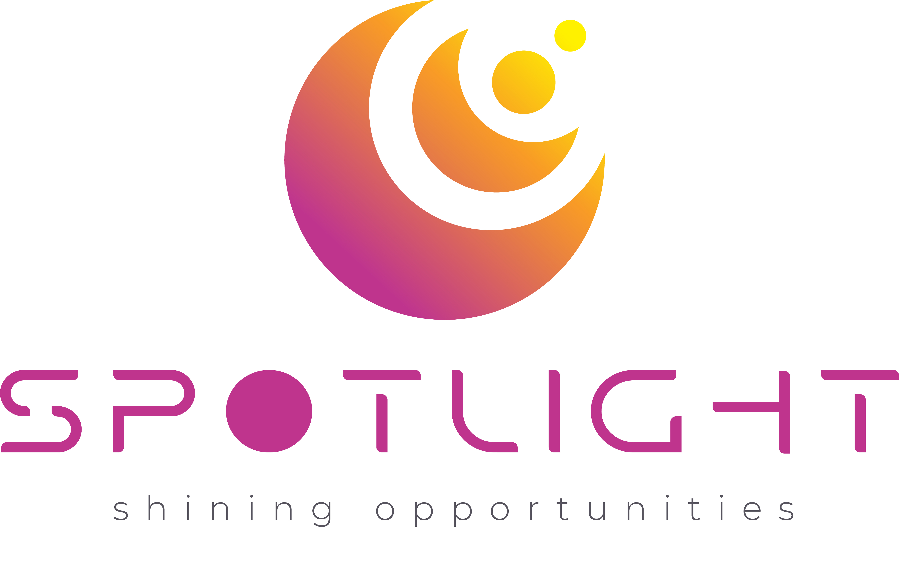

 

# NFT Spotlight

NFT-Spotlight is a new tool to support NFT collectors and traders, particularly new adopters by providing an objective valuation of NFTs. Using Machine Learning on collection traits, sales data, and social trends, NFT-spotlight machine model the value for past and present trades and predict the expected value in the near future. Our vision is to be the most inclusive NFT trading dApp by allowing our users to manage assets from different leading marketplaces on the Algorand blockchain.

## Functionalities

Some of the different functionalities of the dApp include:

- Data-driven valuation
  keep track of your portfolio’s value

- Parametrised selling
  choose the best price to sell at a given time for a very likely sell (90-95% confidence interval)

- NFTs on sale!
  search the market for undervalued opportunities

- Integrated marketplaces
  interact directly on the leading marketplaces to buy, sell and bid by just connecting your wallet

- The future is cross-chain
  Don't limit your NFT activity to one chain - leverage all of the crypto market in one place. 

## Roadmap

In our first stage, we will focus on the core functionality of selling and buying on our app and integrate a limited amount of collections. New ones will be added gradually as we can digest more data from sales and traits and add it to our price prediction model.

A second stage will focus on integrating other multiple marketplaces and keep adding functionalities on all chains. 

A detailed plan can be seen [here](https://spotlight-explorer.herokuapp.com/road-map).

## Algorand Greenhouse Hack 2 

As the [winner of the grand prize of the Algorand Greenhouse Hack 1](https://twitter.com/DevGreenhouse/status/1569404923967569920), we intend to enhance our knowledge and expand our skills in the Algorand dAPP building by participating in the Algorand Greenhouse Hack 2, check more information in this [link](https://gitcoin.co/issue/29368).  We submitted the dApp's first stage on November 2nd and keep working on the next stages from there on.

## Demo Video

For a demo of Spotlight's functionalities watch [this short video](http://www.nft-spotlight.xyz/demovideo).

## Wireframe / Userflow

We have planned and are in the process of implementing significantly expanded functionality including cross-chain one-click NFT selling/biding/buying, automated and improved accuracy modeling for the top NFT projects on the targeted chains, and probabilistic modelling for the sale value of a given NFT given a finite forward-looking sales window. Here and here you can find [wireframe](https://www.figma.com/file/zq0WXCxpMJwdvTgT8FHyDG/Brief%2FPersonae%2F-Competitor-analysis%2F-Task-flow?node-id=26%3A39) and [user flow](https://www.figma.com/file/6uny4kmc5fDo0mv6tzGAs8/nft-spotlight-Mobile-userflow-V1?node-id=0%3A1) of the project respectively.

## Development

NFT-spotlight consists of three apps: NFT explorer, NFT transactions and Landing page. The NFT explorer is developed by python-Django, the NFT transactions by React/typescript and the landing page by Next.js. This repository contains the NFT explorer app and the NFT transactions repository can be found through the following links: [NFT transactions](https://gitlab.com/nft-spotlight/algowallet) and [Landing Page](https://gitlab.com/nft-spotlight/spotlight-node). 

### Getting started

First install Python dependencies

    $ pipenv install

    $ pipenv run python manage.py migrate --settings=spotlight.settings.local_settings

Then you can run the server

    $ pipenv run python manage.py runserver --settings=spotlight.settings.local_settings

### Database migration strategy

Database schema state is maintained using Django migrations.
What does it mean?
Each change in the code that is impacting detabase schema
must be accompanied by some code responsible for keeping the database in sync.
This is relatively easy with Django feature called migrations.

What does it mean?

1) Everytime you change some models
    you need to run this command:

        $ python manage.py makemigrations

    It will generate some additional Python files
    that need to be commited along with your changes.
    You will also need to apply them 
    on your local database for your code to work (see next bullet point)

2) Everytime you receive some changes
    (e.g. by pulling from the repo or deploying a new image)
    you need to apply those changes to the database schema
    by running this command:

        $ python manage migrate

    This will apply pending migration files
    so that the database will be in sync with the model code.

